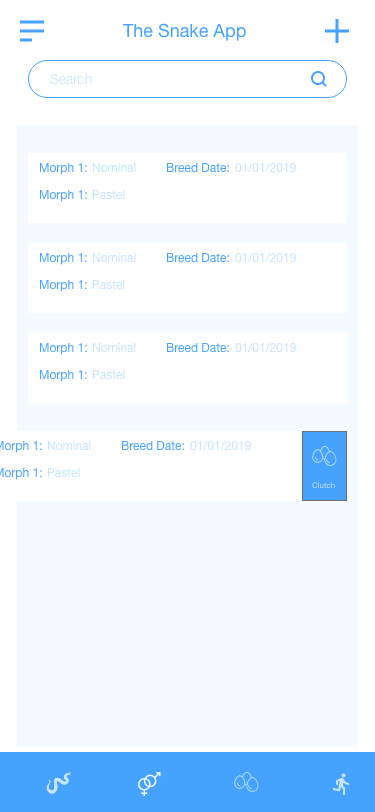

# The Snake App iOS
## Description
TSA is an app that will help Snake's keepers to manage all of is snakes, this includes a close look on every snake (feed, med checks, cleans, sheds).
Breeding controls, as clutch controls.
Setting Lost and dead snakes.
This App also allows changing basic User info.

This is a Multi-platform app and will be connected with android app.

## Wireframe - Low Fidellity
Wireframes are used to see UX, basically the way user will interact with the app by knowing where will the buttons, text's, etc. will be.

### Lobby - Snake Lists

### Escape

### Breed

## Mockup - High Fidellity
A high fidellity design will mostly be recognized as a Mock up, this is the way the app will look, colors, fonts used, etc.

## Made with
* [AdobeXd](https://www.adobe.com/mx/products/xd.html) - Adobe Xd

## Author 
 **Jay Ramirez**  [MoreRepos](https://github.com/JayRmz)
